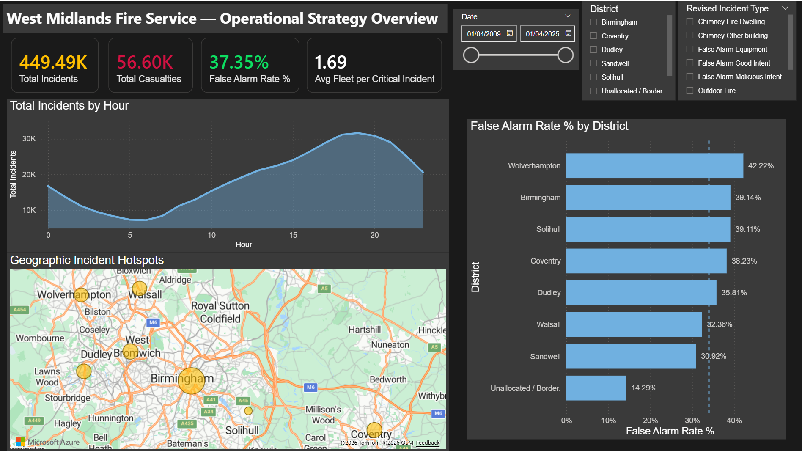
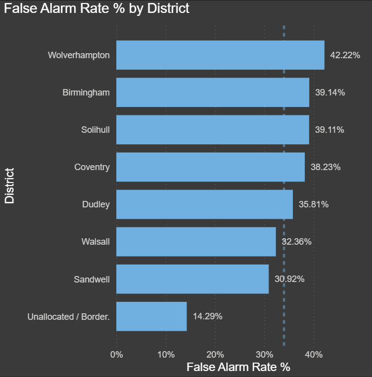
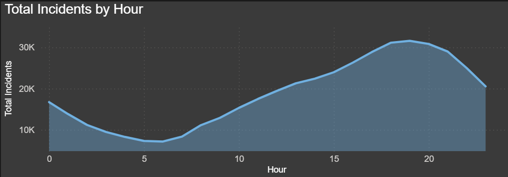
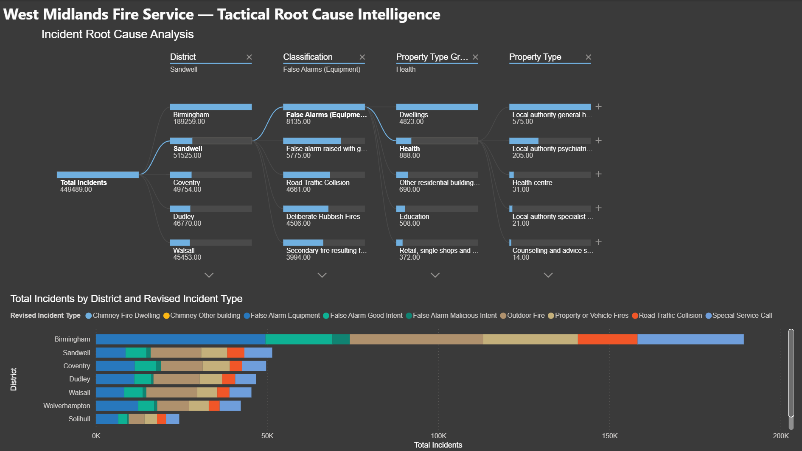
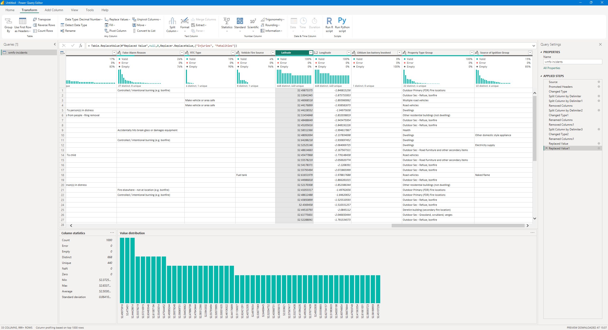
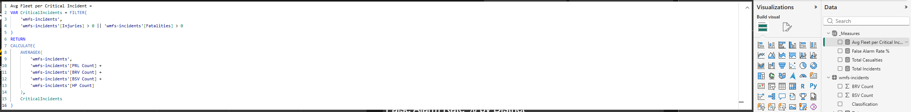

# 🚒 West Midlands Fire Service (WMFS) Operational Intelligence Dashboard


*(Above: Page 1 - Executive Strategy Overview, showing where and when regional resources are under the most operational pressure.)*

## 🎯 Project Overview
As a West Midlands-based BEng Civil Engineer, I wanted to investigate how local public services manage their physical assets and response times. I used a public dataset from the Birmingham City Observatory containing **449,490 historical emergency incidents** logged by the West Midlands Fire Service (WMFS).

*   **The Goal:** Build an interactive, two-page Power BI dashboard to show where resources are being deployed efficiently and where they are being wasted.
*   **The ROI:** Identified a regional **37.35% False Alarm Rate** (representing 167,000 wasted call-outs). Normalising this data allows local councils to target specific prevention areas, potentially reducing unnecessary vehicle wear and fuel costs.

---

## 💡 What the Data Shows (Operational Insights)
*Summary of analytical findings extracted from the dashboard:*

### 1. The Regional Waste Leaderboard (Normalised Data)
If we only look at raw numbers, Birmingham always appears to be the primary drain because of its size. By normalising the data into a percentage rate, I identified that **Wolverhampton** actually has the highest operational waste, with **42.22%** of all dispatches being false alarms, followed by Birmingham (39.14%).


### 2. Peak Demand Times
By grouping the incident times into hourly blocks, I isolated a clear "bimodal" peak in daily demand. The network experiences its highest pressure at **17:00 (5 PM)** and **08:00 (8 AM)**. This peak hour analysis can directly inform crew shift-scheduling and vehicle readiness.


### 3. Root Cause Investigation
On Page 2, I built an interactive **Decomposition Tree** that allows managers to drill down into the data. 
*   **The Discovery:** Selecting **Sandwell** and drilling into **False Alarms (Equipment)** reveals that **Health Properties** (specifically Local Authority Psychiatric Hospitals and Health Centres) are the primary drivers of false alarms in our local borough, rather than standard domestic homes.


---

## 🛠️ How I Built It (ETL & DAX Pipeline)

### 1. Power Query ETL (Data Cleaning)
I wrote an automated ingestion pipeline in Power Query to clean the raw 100MB+ file:
*   **Time-Series Split:** Extracted discrete `Date` and `Time` columns from a combined date-time string.
*   **Geospatial Processing:** Split combined coordinate strings into decimal `Latitude` and `Longitude` values for map rendering.
*   **Null-Value Mitigation:** Replaced empty text strings with `"Unrecorded"` and transformed nulls in casualty columns to `0` to ensure calculation completeness across 449k rows.



### 2. Operational DAX Calculations
I created a dedicated measures table to house the business logic, keeping my DAX formulas clean, efficient, and easy to interpret:



```dax
-- Calculating the percentage of false alarms across all incidents
False Alarm Rate % = 
DIVIDE(
    CALCULATE(COUNTROWS('wmfs-incidents'), 'wmfs-incidents'[Incident_Type] = "False Alarm"),
    COUNTROWS('wmfs-incidents'),
    0
)
```
## 🏆 Skills Demonstrated

*   **Large-Scale Data Handling:** Successfully managed and visualised an operational dataset containing over **449,000 records** without performance degradation.
*   **Data Cleaning (ETL):** Designed robust, automated ingestion pipelines in Power Query to parse, clean, and standardise high-variance public sector files.
*   **Advanced Power BI & DAX:** Applied variables, context transition, and complex iterative calculations (`AVERAGEX` + `FILTER`) to model resource allocations.
*   **User-Centred Design (UI/UX):** Developed a high-contrast, dark-themed operational dashboard designed specifically for rapid decision-making (the **3-Second Rule**).
*   **Operations & Logistics:** Translated raw dispatch numbers into actionable insights regarding vehicle deployment costs, fleet pressure, and asset maintenance.

---

### 🎓 Project Credentials
*   **Developer:** Katen Morker
*   **Credentials:** BEng (Hons) Civil Engineering | Certified Data Analyst
*   **Source Data:** West Midlands Fire Service (WMFS) via the Birmingham City Observatory
